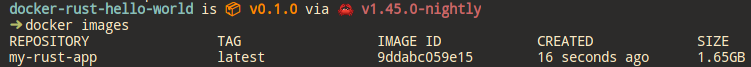

# Docker and Rust Hello World Example

I am new to Rust and Docker, I have been trying to containerize one of my Rust projects. I have been struggling a lot with the example Dockerfile on the official, so this is my attempt to simplify the process as much as possible.

## Example 1

1. Create a new Rust application

```bash
cargo new --bin docker-rust-hello-world
```

2. Copy the exact Dockerfile from the [Official Rust Docker Image](https://registry.hub.docker.com/_/rust/) page

```dockerfile
FROM rust:1.31

WORKDIR /usr/src/myapp
COPY . .

RUN cargo install --path .

CMD ["myapp"]

```
3. Replace `myapp` with the `docker-rust-hello-world` as that is the name of my application
4. Build the image

```bash
docker build -t my-rust-app .
```



5. Run the container

```bash
docker run -it --rm --name my-running-app my-rust-app
```

6. You should see `Hello, world!` written to the terminal, and the container should then stop

## Example 2
